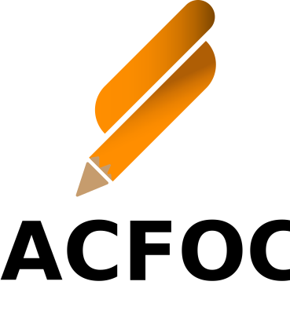

<p align="center">
	
</p>

## Table of Contents
- [Installation](#installation)
- [Basic Usage](#basic-usage)
- [Possible Penalties](#possible-penalties)
- [Properties](#properties)
- [Methods](#methods)

<br>

## Getting Started

----
## Installation

Import the package  via [JSDelivr](https://jsdelivr.net)
```html
<script src='https://cdn.jsdelivr.net/gh/jabo-bernardo/acfoc/dist/build.js'></script>
```

<br>

---
## Basic Usage
Creating a new instance of ACFOC.
```js
const acfoc = new ACFOC();
acfoc.initialize();
```
To verify that the code above is working check the devtools and you should see a log from the ACFOC script.

<br>

---
## Possible Penalties
```css
Idling
```
This penalty will trigger once the user went idle
```css
Copying
```
This penalty will trigger once the user tried to copy something
on the page
```css
Pasting
```
This penalty will trigger once the user tried to paste contents on the page
```css
Changing Focus
```
This penalty will trigger when the user did the following:
- Opened developer tools
- Switch/created new tab
- Opened another application

<br>

---
## Properties
```js
const _ = new ACFOC({
	/* Properties Here */
})
```

- `idleTimeout` : Number - How long ACFOC will wait before it gives a idle penalty.
- `allowCopy` : Boolean - Should the page allow copying?
- `allowPaste` : Boolean - Should the page allow pasting?
- `allowIdle`: Boolean - Should the page ignore idling?
- `scores` : Object - Change scoring for specific penalty
	- `idle` : {Number} - Score will give the user on idling
	- `copy` : {Number} - Score will give the user on copying
	- `paste` : {Number} - Score will give the user on pasting
	- `changeFocus` : {Number} - Score will give the user on tab changing, opening another application, or opening developer tools

<br>

---
## Methods
```js
ACFOC.getIdlePenalty()
```
Get the list of penalties regarding idling
```js
ACFOC.getCopyPenalty()
```
Get the list of penalties regarding copying
```js
ACFOC.getPastePenalty()
```
Get the list of penalties regarding pasting
```js
ACFOC.getChangeFocusPenalty()
```
Get the list of penalties regarding changing focus
```js
ACFOC.hasSuspectedCheating()
```
Returns true if the user have at least 1 penalties
```js
ACFOC.getTotalScore()
```
Get the total score based on all of the penalties

---
## Support the project
- [Patreon](https://patreon.com/jabobernardo)
- [Ko-fi](https://ko-fi.com/jabobernardo)
